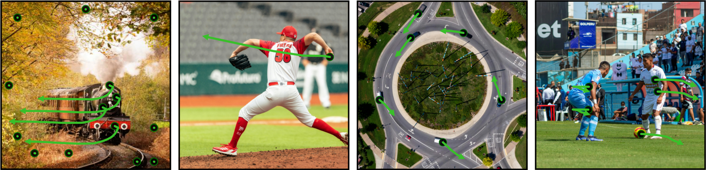
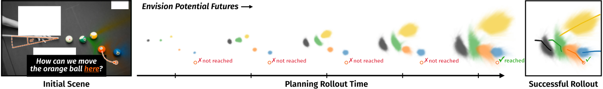

# MYRIAD: Envisioning the Future, One Step at a Time

[](https://compvis.github.io/myriad)
[](https://arxiv.org/abs/2604.09527)
[](https://huggingface.co/CompVis/myriad)
[](https://huggingface.co/datasets/CompVis/owm-95)

<div align="center">
  <a href="https://stefan-baumann.eu/" target="_blank">Stefan A. Baumann</a><sup>*,1,2</sup> · 
  <a href="" target="https://scholar.google.com/citations?hl=en&user=hgMtPk0AAAAJ">Jannik Wiese</a><sup>*,1,2</sup> · 
  <a href="" target="https://scholar.google.com/citations?user=3HCXNX4AAAAJ&hl=en">Tommaso Martorella</a><sup>1,2</sup> · 
  <a href="" target="https://scholar.google.com/citations?hl=en&user=gleejrUAAAAJ">Mahdi M. Kalayeh</a><sup>3</sup> · 
  <a href="https://ommer-lab.com/people/ommer/" target="_blank">Björn Ommer</a><sup>1,2</sup>
</div>
<p align="center"> 
  <b><sup>1</sup>CompVis @ LMU Munich, <sup>2</sup>MCML, <sup>3</sup>Netflix</b><br/>CVPR 2026
</p>




From a single image MYRIAD predicts distributions over sparse point trajectories autoregressively. This allows us to predict physically consistent futures in open-set environments (top) conditioned on input movements. By exploring directly in motion space, we can rapidly explore thousands of counterfactual futures, enabling planning by search - here to select a billiard shot (bottom).


> [!NOTE]
> This repository is a landing page for **Myriad** and primarily exists to host the project website.
> 
> **➡️ The official code lives in [`CompVis/flow-poke-transformer`](https://github.com/CompVis/flow-poke-transformer).**  
> Please refer to that repository for code, setup, and inference instructions.

## 🎓 Citation

```bibtex
@inproceedings{baumann2026envisioning,
    title={Envisioning the Future, One Step at a Time},
    author={Baumann, Stefan Andreas and Wiese, Jannik and Martorella, Tommaso and Kalayeh, Mahdi M. and Ommer, Bj{\"o}rn},
    booktitle={Proceedings of the IEEE/CVF Conference on Computer Vision and Pattern Recognition (CVPR)},
    year={2026}
}
```
